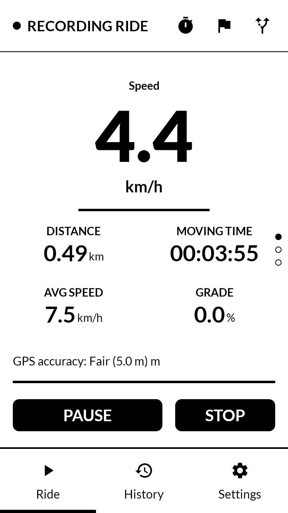
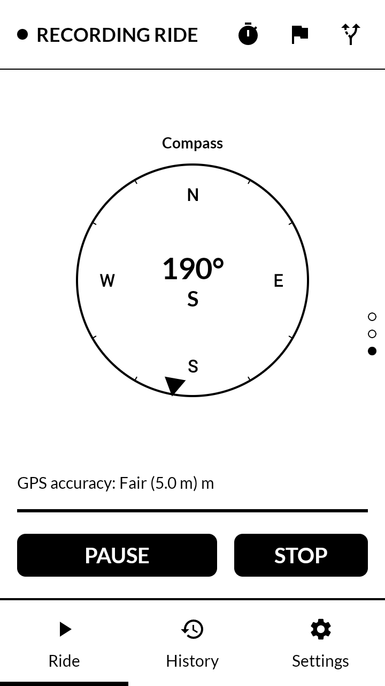
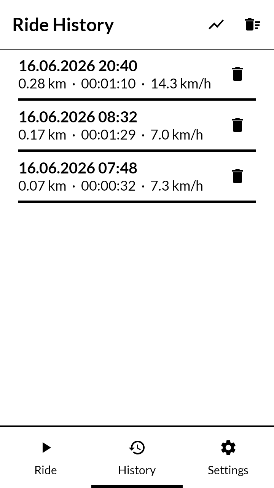
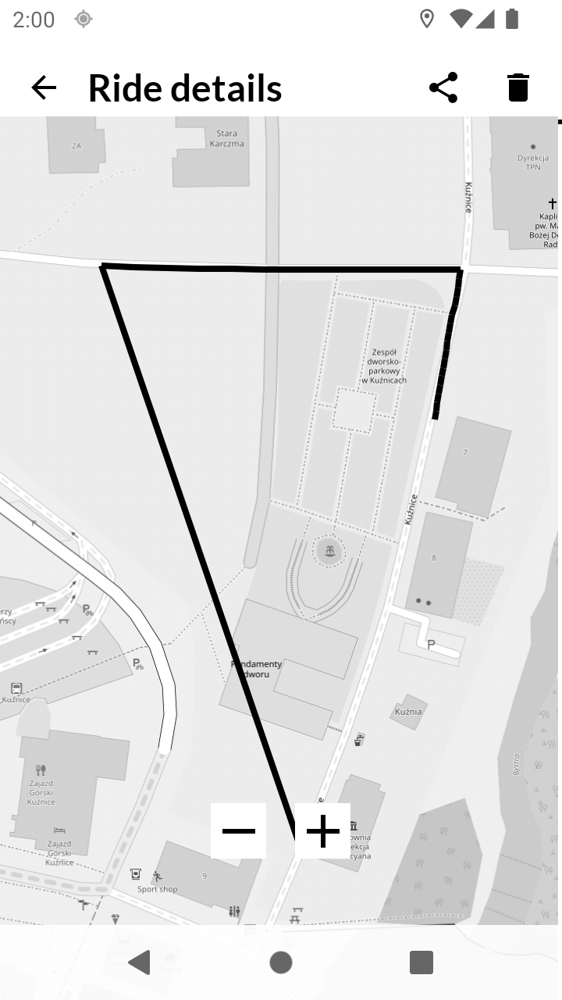

# InkRide 🚲

InkRide is a specialized Android bicycle computer application, meticulously engineered and optimized for **E-Ink displays**. It prioritizes high legibility under direct sunlight, minimalist aesthetics, and "de-googled" privacy.

<p align="center">
  
  
  
  
</p>

📸 See **[SCREENSHOTS.md](SCREENSHOTS.md)** for a full walkthrough of every screen and feature.

## 🎨 Design Process & Philosophy

The design of InkRide was driven by a strict "E-Ink first" approach, focusing on the unique constraints and strengths of electronic paper technology.

### 1. Research & Constraints Mapping
- **Refresh Rates:** Traditional 60Hz UI patterns cause significant ghosting and battery drain on E-Ink. We mapped out areas where updates could be minimized (e.g., updating metrics every 1-2 seconds instead of every frame).
- **Contrast over Color:** Since E-Ink is monochromatic (or grayscale), we abandoned shadows and gradients in favor of high-contrast solid lines and bold typography.
- **Outdoor Glanceability:** The UI is designed to be read at a distance while riding, leading to the decision to use extremely large font scales for primary data.

### 2. Adopting Mudita Mindful Design (MMD)
To ensure a consistent and distraction-free experience, InkRide adopts the **Mudita Mindful Design** philosophy.
- **Components:** We leverage the `mmd-core` library for standard UI elements like buttons and headers, ensuring they are optimized for E-Ink out of the box.
- **Simplicity:** The interface is stripped of unnecessary animations that would otherwise feel sluggish or "dirty" on E-Ink.

### 3. Technical Design Decisions
- **Discrete State Updates:** Instead of fluidly rotating the compass, we update it in 2-degree discrete steps. This reduces the number of partial refreshes and keeps the display "cleaner."
- **De-googled Architecture:** By strictly using the standard Android `LocationManager` API (`GPS_PROVIDER`) and avoiding GMS (Google Play Services), the app is fully compatible with privacy-focused ROMs like GrapheneOS or CalyxOS.
- **Clean Modular Architecture:** The project is split into feature-layered modules (`presentation`, `domain`, `data`) to ensure maintainability and testability.

## 🚀 Features

- **Real-time Dashboard:** High-contrast speedometer, compass, altitude (GPS + barometer), grade %, calories, power, and GPS quality indicator.
- **Ride Tracking:** Background recording with auto-pause, lap tracking, ride goals (distance/duration), and a keep-screen-on wake lock.
- **GPX Track Recording & Export:** Every ride's GPS track is saved and can be exported as a standard GPX file for use in Strava, Komoot, OsmAnd, etc.
- **Route Navigation:** Load a `.gpx` route and follow it on the dashboard, with off-route alerts and "next turn in X" guidance.
- **Ride History & Maps:** Browse past rides, view per-lap breakdowns, and see the recorded route plotted on an offline-friendly OSM map.
- **Lifetime Statistics:** Total distance, ride count, and all-time records across your riding history.
- **Bluetooth LE Sensors:** Pair heart-rate and cadence/speed sensors (standard GATT profiles, no GMS) for richer ride metrics.
- **Weather Trend:** Barometric pressure trend (rising/falling/stable) shown as a static, E-Ink-friendly indicator — no internet required.
- **Bike Profiles & Alerts:** Multiple bike profiles (weight, type) and configurable speed/heart-rate alerts with vibration feedback.
- **E-Ink Friendly UI:** Tailored components from Mudita Mindful Design, with discrete state updates and no fluid animations.
- **Privacy First:** No Firebase, no Google Analytics, no GMS required; all data stored locally via Room. Map tiles are the only network traffic, fetched on demand from OpenStreetMap.
- **Hardware Optimized:** Minimal CPU usage to maximize battery life on E-Ink devices.

## 🛠 Tech Stack

- **Language:** Kotlin
- **UI:** Jetpack Compose (optimized for low refresh)
- **Design System:** Mudita Mindful Design (MMD)
- **DI:** Koin
- **Database:** Room
- **Navigation:** Type-safe Compose Navigation
- **Location:** Android `LocationManager` with `GPS_PROVIDER` (FOSS-friendly, no GMS)
- **Connectivity:** Standard `BluetoothLeScanner`/GATT for heart-rate and cadence sensors (no GMS)
- **Maps:** OsmDroid with OpenStreetMap tiles (FOSS, the app's only network usage)

## 🏗 Project Structure

InkRide follows a modular Clean Architecture:
- `:app`: The entry point and DI graph root.
- `:core:*`: Shared logic (design system, database, domain models, presentation helpers, data-layer bridge).
- `:feature:*`: Scalable feature modules — `dashboard`, `history`, `settings`, `tracking`, `ble`.

## 📥 Getting Started

1. Clone the repository.
2. Open in Android Studio (Koala or newer recommended).
3. Build and deploy to an Android device (ideally an E-Ink device like Hisense A-series, Boox, or Mudita Kompakt).

### 📱 Mudita Kompakt Compatibility

InkRide is designed with the **Mudita Kompakt** as a primary target device:
- The UI directly adopts **Mudita Mindful Design (MMD)**, the same design system used on Kompakt's native apps, so InkRide feels consistent with the rest of the device.
- `minSdk 26` and a de-googled, GMS-free stack (standard `LocationManager`, `BluetoothLeScanner`) match Kompakt's AOSP-based, Google-free software.
- Discrete, low-refresh UI updates (2° compass steps, 1-2s metric refresh, no fluid animations) avoid ghosting on the Kompakt's E-Ink panel.
- High-contrast monochrome layouts and large primary data scale are tuned for the Kompakt's display under outdoor sunlight.

```bash
./gradlew assembleDebug        # Build a debug APK
./gradlew testDebugUnitTest    # Run the unit tests
```

## 📦 Releases

Signed release APKs are built automatically on every merge to `main` and published
under [Releases](../../releases). See [RELEASING.md](RELEASING.md) for the signing
setup and how to build a release locally.

## 📄 License

InkRide is open source under the [Apache License 2.0](LICENSE).

---
*Built with mindfulness and focus.*
