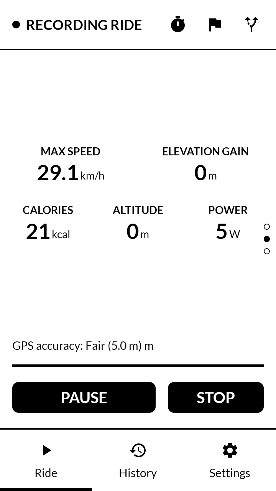
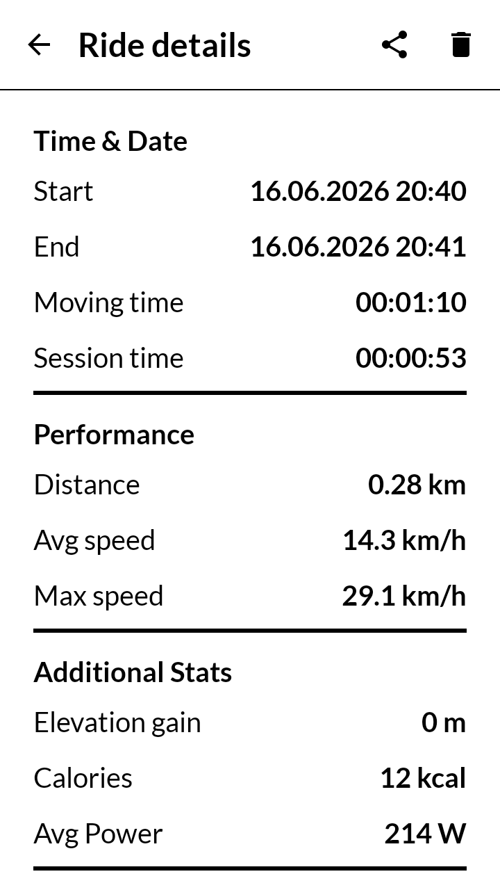
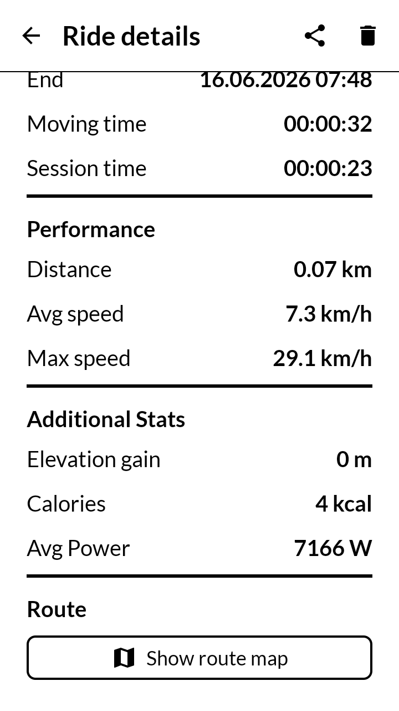
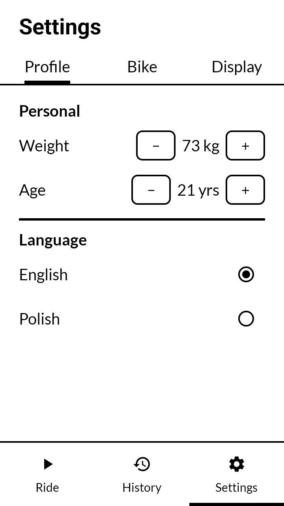
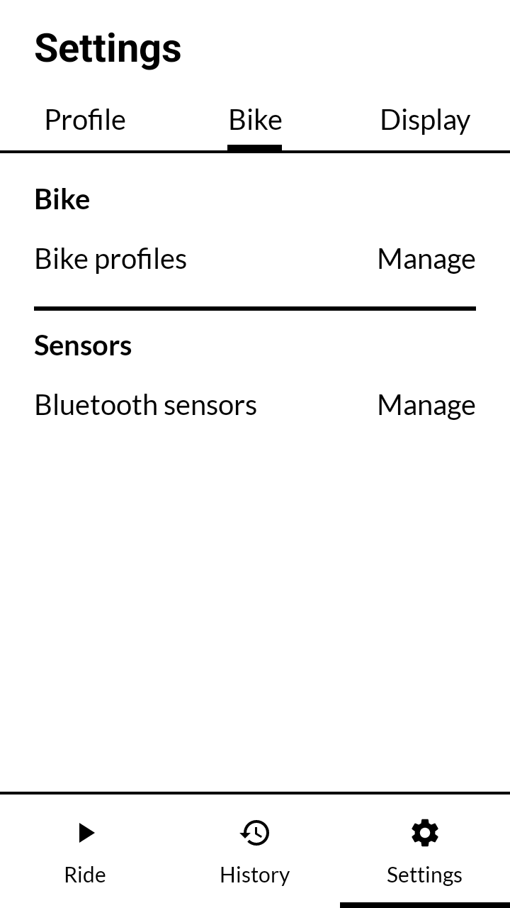
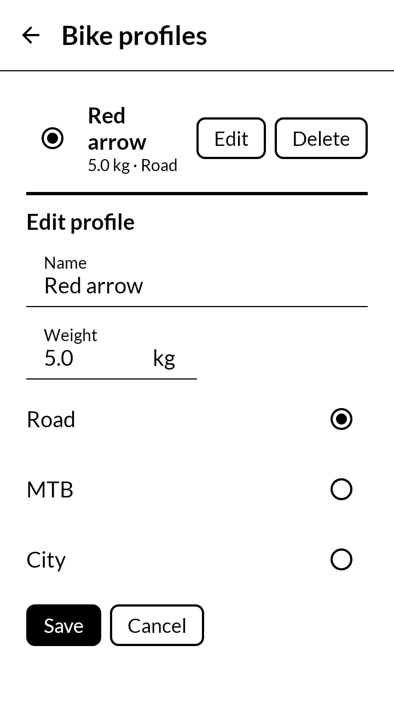
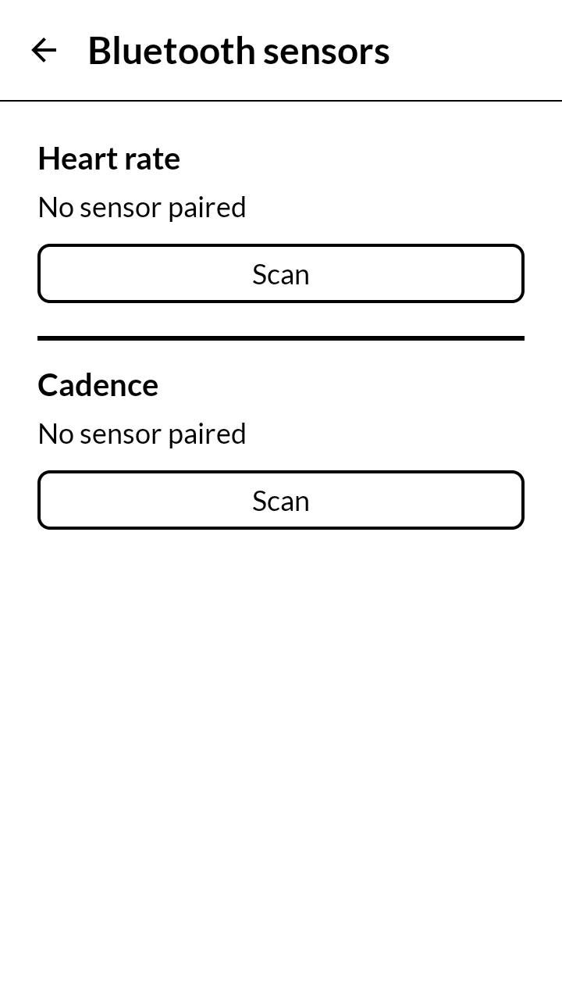
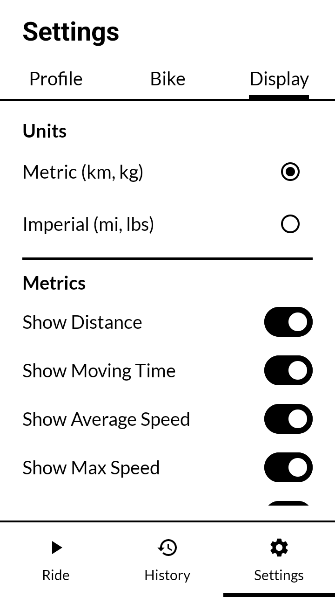
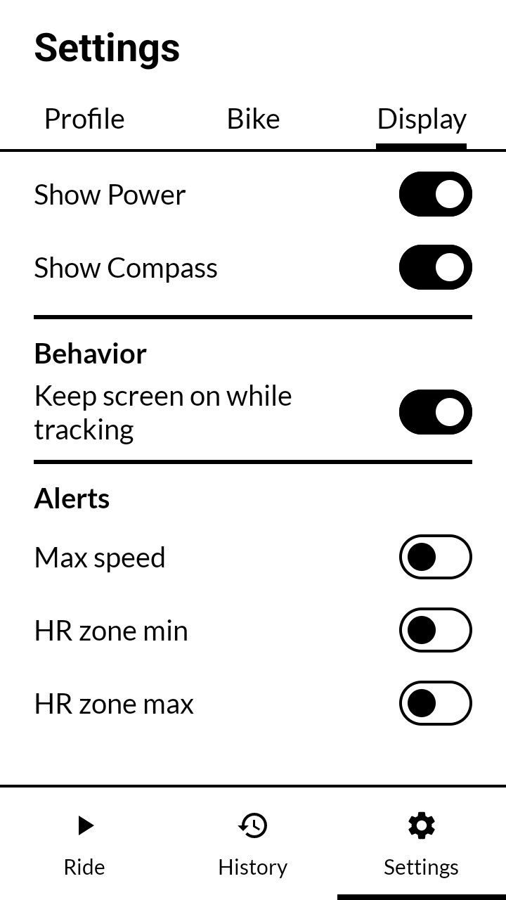

# 📸 Screenshots

A visual tour of InkRide, captured on an E-Ink-style monochrome display. Screenshots are grouped by feature area.

## Dashboard (Live Ride Tracking)

The dashboard is a horizontal pager with three pages, so a rider can swipe to the metrics that matter most without cluttering a single screen.

| Speed & Core Metrics | Secondary Metrics | Compass |
|---|---|---|
|  |  |  |
| Large, high-contrast speed readout plus distance, moving time, average speed, grade %, and live GPS accuracy. `PAUSE`/`STOP` controls are always reachable. | Max speed, elevation gain, calories, altitude (GPS + barometer), and estimated power for the current ride. | Discrete 2°-step compass heading, kept legible and ghosting-free on E-Ink. |

## Ride History & Details

| Ride History List | Ride Summary | Route on Map |
|---|---|---|
|  |  |  |
| All recorded rides with date, distance, duration, and average speed at a glance. | Full breakdown per ride: time & date, performance (distance, avg/max speed), and additional stats (elevation gain, calories, average power). | The recorded GPS track plotted on an offline-friendly OpenStreetMap view, opened from the "Show route map" action in ride details. |

Scrolling further down a ride's details reveals the remaining stats and the **Show route map** entry point shown above.

## Settings — Profile

Rider profile (weight, age) used for calorie/power estimation, plus app language selection (English/Polish).

## Settings — Bike & Sensors

| Bike Tab | Bike Profile Editor | Bluetooth Sensors |
|---|---|---|
|  |  |  |
| Entry points to manage bike profiles and paired Bluetooth sensors. | Create or edit a bike profile: name, weight, and type (Road/MTB/City) — used in ride metric calculations. | Pair BLE heart-rate and cadence sensors using standard GATT profiles, no Google Mobile Services required. |

## Settings — Display

| Units & Metric Toggles | Behavior & Alerts |
|---|---|
|  |  |
| Choose metric/imperial units and toggle which metrics appear on the dashboard (distance, moving time, avg/max speed, power, compass, ...). | Keep-screen-on while tracking, plus configurable alerts for max speed and heart-rate zone thresholds. |
